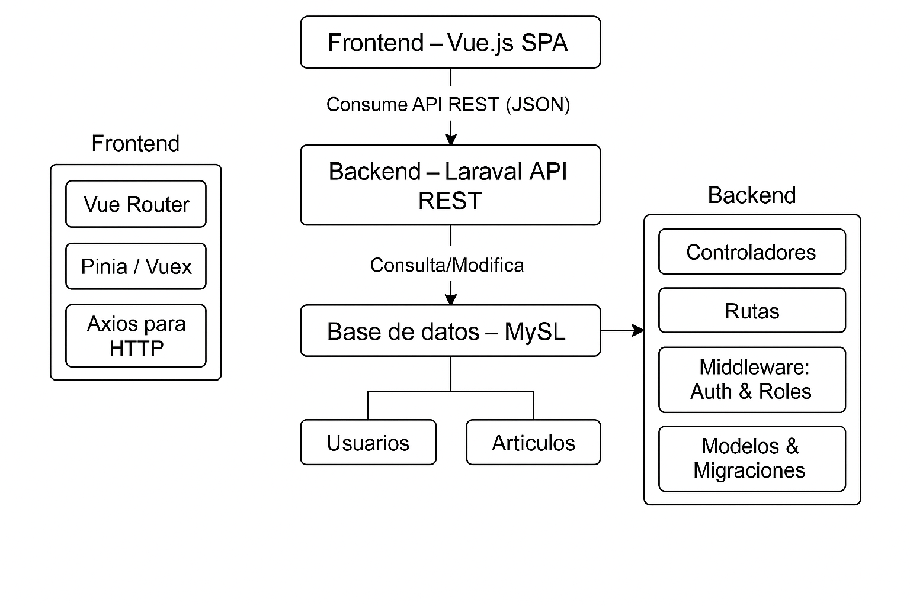

# 📰 MANAGER_NEWS - Portal Editorial de Noticias

Trabajo Final - Programación de Vanguardia  
Universidad de la Ciudad de Buenos Aires  
Grupo 5  

---

## 1. Descripción del Sistema

MANAGER NEWS es una plataforma editorial de noticias desarrollada con arquitectura desacoplada. Permite a usuarios consultar artículos filtrados por categoría, tendencias o etiquetas, y a los administradores gestionar el contenido desde un panel seguro.

### Problema Detectado
Muchos portales informativos no ofrecen filtros útiles, interfaces limpias ni una gestión intuitiva del contenido.

### Solución Propuesta
Desarrollar un sistema moderno, desacoplado, con:
- Navegación intuitiva y visualmente atractiva.
- CRUD de noticias, autores y etiquetas para administradores.
- Roles diferenciados (usuarios, administradores).
- Seguridad y arquitectura modular.

### Tipos de Usuarios
- **Lectores:** Consultan noticias, acceden a detalles, filtran por tags o categorías.
- **Admins:** Autenticados, crean/actualizan noticias, administran autores y etiquetas.

---

## 2. Arquitectura Propuesta



- **Frontend:** SPA hecha con Vue.js 3.
- **Backend:** API REST desarrollada en Laravel 11.
- **Comunicación:** Axios HTTP.
- **Base de datos:** MySQL.
- **Repositorio:** `grupo-5`  
  - `/FrontEnd` → Vue  
  - `/BackEnd` → Laravel

### Decisiones Tecnológicas
- Laravel + Breeze → autenticación rápida y segura.
- Vue 3 + Router → SPA modular y rápida.
- Axios → llamadas asincrónicas al backend.
- Bootstrap 5 → diseño adaptable.

---

## 3. Frontend

- **Tecnología:** Vue.js 3 (SPA)
- **Consumo de API:** Axios
- **Componentes:**  
  - `Home.vue`, `AdminLogin.vue`, `NewsArticle.vue`  
  - `components/` → `Footer.vue`, `TopHeader.vue`, `NewsDetails.vue`, etc.
- **Flujo de navegación:**  
  1. Landing con secciones (carousel, destacados, recientes).
  2. Filtrado por etiquetas y categorías.
  3. Vista de detalle de cada artículo.

---

## 4. Backend

- **Framework:** Laravel 11
- **Controladores RESTful:**
  - `NewsController`, `AuthorController`, `TagController`, `CategoryController`, etc.
- **Endpoints clave:**
  - `GET /api/news`  
  - `POST /api/news`  
  - `PUT /api/news/{id}`  
  - `DELETE /api/news/{id}`  
- **Principios aplicados:**
  - MVC
  - SOLID
  - Middleware por roles
  - Validación con Form Requests

---

## 5. Testing

- **Backend:**
  - `PHPUnit`: test unitarios y de integración.
- **Frontend:**
  - Posibilidad de usar `Jest` y `Vue Test Utils`.
- **Tipos de pruebas:**
  - Unitarias: lógica de modelos y validaciones.
  - Integración: consumo de endpoints.
  - Funcionales (opcional): navegación y flujos.

---

## 6. Despliegue y CI/CD

- **Backend:** Heroku / DigitalOcean (sugerido).
- **Frontend:** Vercel / Netlify.
- **CI/CD:** GitHub Actions (instalación, testeo, deploy automático).
- **Integración:**  
  - `.env` en Vue para apuntar al backend.
  - `.env` en Laravel con conexión a base de datos productiva.

---

## 7. Seguridad

### Medidas de seguridad implementadas

- Autenticación y autorización (Laravel Breeze)
- Hash de contraseñas (bcrypt por defecto en Laravel)
- Validación de datos en backend (Form Requests y validaciones en controladores)
- Protección contra SQL Injection (Eloquent ORM)
- Prevención de XSS en frontend (Vue.js)
- Protección CSRF en rutas web (Laravel)

### Recomendaciones adicionales (a implementar según el entorno)

- Configuración de CORS personalizada
- Middleware de rate limiting
- Uso de HTTPS en producción
- Actualización periódica de dependencias
- Monitoreo y logs de seguridad
- Almacenamiento seguro de tokens (cookies httpOnly)

---

## 8. Comunicación Frontend ↔ Backend con Axios

### 🔁 Flujo de una solicitud típica


## 9. Instalación del Proyecto

### 🔧 Requisitos Previos
- Node.js, npm
- PHP >= 8.1
- Composer
- MySQL
- Git

### 📁 Clonar repositorio
```bash
git clone https://github.com/cmartinf/grupo-5
cd grupo-5

```

### Backend (Laravel) Setup
1. Navegar al directorio de Laravel:
   ```bash
   cd BackEnd
   ```

2. Instalar las dependencias:
   ```bash
   composer install
   ```

3. Copiar el archivo `.env.example` a `.env` y configurar las variables de entorno:
   ```bash
   cp .env.example .env
   php artisan key:generate
   ```

4. Configurar el archivo `.env`:
   - Establece las credenciales de la base de datos: :
     ```
     DB_CONNECTION=mysql
     DB_HOST=127.0.0.1
     DB_PORT=3306
     DB_DATABASE=news_portal
     DB_USERNAME=root
     DB_PASSWORD=your_password
     ```

5. Correr las migraciones y seeders:
   ```bash
   php artisan migrate --seed
   ```

6. El servidor de Laravel en el backend:
   ```bash
   php artisan serve
   ```
   The backend will run at `http://127.0.0.1:8000`.

---

### Frontend (Vue.js) Setup
1. Navegar hasta el directorio Vue.js:
   ```bash
   cd FrontEnd
   ```

2. Instalar las dependencias:
   ```bash
   npm install
   ```

3. Copiar el archivo `.env.example` a `.env`:
   ```bash
   cp .env.example .env
   ```

4. Configurar la URL del backend en `.env`:
   ```bash
   VITE_APP_API_URL=http://127.0.0.1:8000
   ```

5. Iniciar el servidor de desarrollo:
   ```bash
   npm run dev
   ```
   The frontend will run at `http://127.0.0.1:5173`.

---

## Ejecutar la aplicación
- Asegurarse que los servidores **backend** y **frontend** estén funcionando:
  - BackEnd: `php artisan serve`
  - FrontEnd: `npm run dev`
  
- Acceso a la aplicación por **frontend URL** (`http://127.0.0.1:5173`).

---

## 10. Troubleshooting (Solución de Problemas Comunes)

A continuación se agrega una lista con algunos problemas frecuentes durante la instalación y su posible solución:

### ❗ Error: "Could not find driver" (al correr migraciones en Laravel)
- **Causa:** Falta la extensión de PHP para MySQL.
- **Solución:**  
  Instala la extensión ejecutando:
  ```bash
  sudo apt install php-mysql
  ```
  Luego reinicia el servidor web o el servicio PHP.

---

### ❗ Error: "SQLSTATE[HY000] [1045] Access denied for user"
- **Causa:** Credenciales incorrectas en el archivo `.env` de Laravel.
- **Solución:**  
  Verifica que los valores de `DB_USERNAME` y `DB_PASSWORD` coincidan con los de tu base de datos MySQL.

---

### ❗ Error: "npm: command not found" o "node: command not found"
- **Causa:** Node.js y npm no están instalados.
- **Solución:**  
  Instala Node.js y npm:
  ```bash
  sudo apt install nodejs npm
  ```

---

### ❗ Error: "Port already in use" (puerto ocupado)
- **Causa:** El puerto necesario ya está siendo usado por otro proceso.
- **Solución:**  
  - Cambia el puerto en el comando de inicio (`php artisan serve --port=8001` o `npm run dev -- --port=5174`).
  - O libera el puerto matando el proceso que lo usa:
    ```bash
    sudo lsof -i :8000
    sudo kill -9 <PID>
    ```

---

### ❗ Error: "Permission denied" al instalar dependencias
- **Causa:** Falta de permisos en la carpeta del proyecto.
- **Solución:**  
  Ejecuta el comando con `sudo` o cambia los permisos de la carpeta:
  ```bash
  sudo chown -R $USER:$USER /ruta/al/proyecto
  ```

---

### ❗ Problemas con variables de entorno
- **Causa:** El archivo `.env` no está configurado correctamente o falta.
- **Solución:**  
  - Asegúrate de copiar `.env.example` a `.env` y completar los valores necesarios.
  - Reinicia los servidores después de modificar `.env`.

---

Si encuentras otros problemas, revisa la documentación oficial de [Laravel](https://laravel.com/docs) y [Vue.js](https://vuejs.org/guide/), o abre un issue en el repositorio.

---


