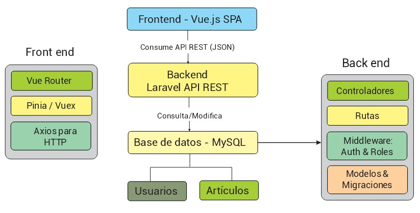
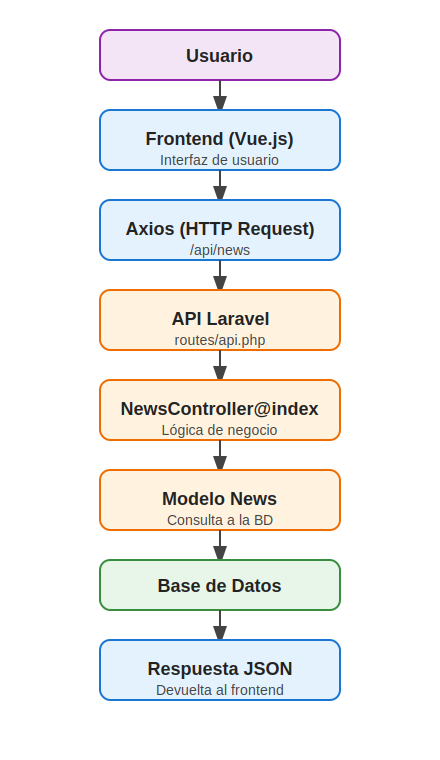

# 📰 MANAGER_NEWS - Portal Editorial de Noticias

Trabajo Final - Programación de Vanguardia  
Universidad de la Ciudad de Buenos Aires  

# Grupo 5  

# 👥 Roles del Equipo de Desarrollo

## 🎯 **Líder de Proyecto / Product Owner**  
**Nombre:** Martín Fariña  
**Función:**  
Define la visión estratégica del producto *Manager News* y actúa como puente entre el equipo técnico y los stakeholders. Prioriza funcionalidades, gestiona al equipo, y garantiza que el desarrollo se alinee con los objetivos del negocio y las necesidades de los distintos usuarios (redactor, lector, moderador).

---

## 🏗️ **Arquitecto de Software / Desarrollador Backend**  
**Nombre:** Martín Fariña  
**Función:**  
Diseña la arquitectura técnica del sistema, construye la lógica del servidor, gestiona la base de datos y asegura la integración fluida de todos los módulos (creación, moderación, lectura de artículos). Se enfoca en garantizar un sistema escalable, robusto y seguro.

---

## 🎨 **Desarrollador Frontend / Diseñadora UI/UX**  
**Nombre:** Paula Quiroga  
**Función:**  
Transforma el diseño visual en una experiencia interactiva, accesible y responsiva. Se encarga de que la interfaz de *Manager News* sea intuitiva y atractiva para usuarios de todos los perfiles. Prioriza la usabilidad, la compatibilidad móvil/escritorio y la estética visual del portal.

---

## 🧪 **Ingeniero de Calidad (QA Tester)**  
**Nombre:** Guillermo Giménez  
**Función:**  
Asegura que la plataforma funcione sin errores y cumpla con estándares de calidad. Diseña y ejecuta pruebas funcionales, de rendimiento y seguridad. Su trabajo previene fallas antes del lanzamiento, garantizando una experiencia fluida para los usuarios finales.

---

## ⚙️ **Especialista en DevOps (Development Operations)**  
**Nombre:** Alejandra Mamani  
**Función:**  
Automatiza los procesos de desarrollo, integración y despliegue. Administra la infraestructura y las herramientas necesarias para que el equipo trabaje de forma ágil y confiable. Asegura la disponibilidad continua de la plataforma y participa activamente en la configuración de entornos seguros.

---

## 🔐 **Especialista en Ciberseguridad**  
**Nombre:** Marcos Machiavello  
**Función:**  
Protege los datos y la infraestructura de *Manager News*. Realiza análisis de vulnerabilidades, pruebas de penetración y aplica controles de seguridad (autenticación robusta, cifrado, control de roles). Asegura el cumplimiento de normativas de privacidad y colabora estrechamente con Backend y DevOps para integrar la seguridad desde el diseño (*Security by Design*).

---

## 1. Descripción del Sistema

MANAGER NEWS es una plataforma editorial de noticias desarrollada con arquitectura desacoplada. Les permite a los usuarios consultar artículos filtrados por categoría, tendencias o etiquetas, y a los administradores gestionar el contenido desde un panel seguro.

### Problema Detectado
Muchos portales informativos no ofrecen filtros útiles, interfaces limpias ni una gestión intuitiva del contenido.

### Solución Propuesta
Desarrollar un sistema moderno, desacoplado, con:
- Navegación intuitiva y visualmente atractiva.
- CRUD de noticias, autores y etiquetas para administradores.
- Roles diferenciados (usuarios, administradores).
- Seguridad y arquitectura modular.

### Tipos de Usuarios
- **Lectores:** Consultan noticias, acceden a detalles, filtran por tags o categorías.
- **Admins:** Autenticados, crean/eliminan/actualizan noticias, administran autores y etiquetas.

---

## 2. Arquitectura Propuesta



- **Frontend:** SPA hecha con Vue.js 3.
- **Backend:** API REST desarrollada en Laravel 11.
- **Comunicación:** Axios HTTP.
- **Base de datos:** MySQL.
- **Repositorio:** `grupo-5`  
  - `/FrontEnd` → Vue  
  - `/BackEnd` → Laravel

### Decisiones Tecnológicas
- Laravel + Breeze → autenticación rápida y segura.
- Vue 3 + Router → SPA modular y rápida.
- Axios → llamadas asincrónicas al backend.
- Bootstrap 5 → diseño adaptable.

---

## 3. Frontend

- **Tecnología:** Vue.js 3 (SPA)
- **Consumo de API:** Axios
- **Componentes:**  
  - `Home.vue`, `AdminLogin.vue`, `NewsArticle.vue`  
  - `components/` → `Footer.vue`, `TopHeader.vue`, `NewsDetails.vue`, etc.
- **Flujo de navegación:**  
  1. Landing con secciones (carousel, destacados, recientes).
  2. Filtrado por etiquetas y categorías.
  3. Vista de detalle de cada artículo.

---

## 4. Backend

- **Framework:** Laravel 11
- **Controladores RESTful:**
  - `NewsController`, `AuthorController`, `TagController`, `CategoryController`, etc.
- **Endpoints clave:**
  - `GET /api/news`  
  - `POST /api/news`  
  - `PUT /api/news/{id}`  
  - `DELETE /api/news/{id}`  
- **Principios aplicados:**
  - MVC
  - SOLID
  - Middleware por roles
  - Validación con Form Requests

---

### 5. Testing

El proceso de testing es fundamental para garantizar la calidad, estabilidad y seguridad del sistema. En el proyecto MANAGER_NEWS se han implementado pruebas en ambos extremos de la arquitectura desacoplada: backend y frontend.

#### Backend

- **PHPUnit:** Framework utilizado para la realización de pruebas unitarias y de integración en el backend desarrollado con Laravel.  
  - **Pruebas unitarias:** Validan la lógica interna de los modelos, controladores y servicios, asegurando que cada componente individual funcione correctamente.  
  - **Pruebas de integración:** Evalúan la interacción entre múltiples componentes, por ejemplo, el correcto manejo de peticiones y respuestas, y la comunicación con la base de datos.

#### Frontend

- **Jest y Vue Test Utils:** Herramientas seleccionadas para la ejecución de pruebas unitarias y de integración en el frontend desarrollado con Vue.js.  
  - **Pruebas unitarias:** Validan el comportamiento de componentes individuales, funciones y métodos.  
  - **Pruebas de integración:** Comprueban la interacción entre componentes, así como el correcto consumo de endpoints mediante Axios.

#### Tipos de pruebas implementadas

- **Pruebas Unitarias:** Focalizadas en validar la funcionalidad aislada de módulos, clases o funciones para detectar errores en la lógica interna.  
- **Pruebas de Integración:** Evaluación conjunta de varios componentes para verificar su correcto funcionamiento en conjunto.  
- **Pruebas Funcionales (opcional):** Simulación del comportamiento del usuario y flujos completos dentro de la aplicación para asegurar que los casos de uso estén cubiertos.

---

### 6. Entorno de Producción

Para el despliegue y operación del proyecto MANAGER NEWS en un entorno productivo se pensaron en las siguientes herramientas y configuraciones:

#### Infraestructura

- **Backend:** Desplegado en plataformas cloud como **Heroku** o **DigitalOcean** (sugerido), que ofrecen escalabilidad y estabilidad.  
- **Frontend:** Hospedado en servicios especializados para aplicaciones estáticas o SPA como **Vercel** o **Netlify**, optimizados para Vue.js.

#### Integración Continua y Despliegue (CI/CD)

- **GitHub Actions:** Configurado para automatizar la instalación de dependencias, ejecución de pruebas (testing) y despliegue automático en cada push a ramas específicas (ej. `main` o `production`).  
- Esto asegura que cada cambio en el código pase por validaciones antes de ser publicado en producción, garantizando calidad y minimizando errores en el despliegue.

#### Configuración y Variables de Entorno

- **Frontend:** Uso de un archivo `.env` en Vue para definir la URL del backend en producción (API REST), asegurando que las peticiones apunten al entorno correcto.  
- **Backend:** Archivo `.env` en Laravel configurado con los datos de conexión a la base de datos productiva y otras variables sensibles (clave de API, configuración mail, etc.), manteniendo la seguridad y separación de entornos.


## 🌐 Acceso público seguro con Cloudflare Tunnel

Durante el desarrollo del proyecto, utilizamos **Cloudflare Tunnel (`cloudflared`)** para exponer de forma segura tanto el frontend como el backend en la web, sin necesidad de abrir puertos en el router ni contar con una IP fija.

Esto permite al equipo trabajar desde distintas ubicaciones y mostrar el proyecto en tiempo real desde una computadora local.

### ¿Cómo lo usamos?

Un script Bash automatiza el proceso:

   ```bash
   #!/bin/bash

echo "Iniciando Laravel..."
cd /grupo-5/BackEnd
php artisan serve &

echo "Iniciando Vue..."
cd /grupo-5/FrontEnd
npm run dev &

echo "Esperando 5 segundos..."
sleep 5

echo "Iniciando Cloudflared..."
cloudflared tunnel --url http://localhost:5173
   ```

Cada ejecución genera una URL temporal del tipo:

https://xxxxx.trycloudflare.com


Esto es ideal para pruebas, revisiones en tiempo real y presentaciones académicas, sin necesidad de desplegar el proyecto en un servidor público.

### 🟢 Beneficios del uso de Cloudflare Tunnel

- ✅ **HTTPS automático** (sin necesidad de certificados ni configuración extra)
- 🌍 **Acceso inmediato y remoto** desde cualquier lugar
- 🔒 **Sin puertos abiertos** en el router ni exposición directa a Internet
- ⚡ **Rápido, seguro y gratuito**
- 💡 Perfecto para **trabajo colaborativo y presentaciones** sin infraestructura compleja
---

## 7. Seguridad

### Medidas de seguridad implementadas

- Autenticación y autorización (Laravel Breeze)
- Hash de contraseñas (bcrypt por defecto en Laravel)
- Validación de datos en backend (Form Requests y validaciones en controladores)
- Protección contra SQL Injection (Eloquent ORM)
- Prevención de XSS en frontend (Vue.js)
- Protección CSRF en rutas web (Laravel)

### Recomendaciones adicionales (a implementar según el entorno)

- Configuración de CORS personalizada
- Middleware de rate limiting
- Uso de HTTPS en producción
- Actualización periódica de dependencias
- Monitoreo y logs de seguridad
- Almacenamiento seguro de tokens (cookies httpOnly)

---

## 8. Comunicación Frontend ↔ Backend con Axios

### 🔁 Flujo de una solicitud típica



## 9. Instalación del Proyecto

### 🔧 Requisitos Previos
- Node.js, npm
- PHP >= 8.1
- Composer
- MySQL
- Git

### 📁 Clonar repositorio
```bash
git clone https://github.com/cmartinf/grupo-5
cd grupo-5

```

### Backend (Laravel) Setup
1. Navegar al directorio de Laravel:
   ```bash
   cd BackEnd
   ```

2. Instalar las dependencias:
   ```bash
   composer install
   ```

3. Copiar el archivo `.env.example` a `.env` y configurar las variables de entorno:
   ```bash
   cp .env.example .env
   php artisan key:generate
   ```

4. Configurar el archivo `.env`:
   - Establece las credenciales de la base de datos: :
     ```
     DB_CONNECTION=mysql
     DB_HOST=127.0.0.1
     DB_PORT=3306
     DB_DATABASE=news_portal
     DB_USERNAME=root
     DB_PASSWORD=your_password
     ```

5. Correr las migraciones y seeders:
   ```bash
   php artisan migrate --seed
   ```

6. El servidor de Laravel en el backend:
   ```bash
   php artisan serve
   ```
   The backend will run at `http://127.0.0.1:8000`.

---

### Frontend (Vue.js) Setup
1. Navegar hasta el directorio Vue.js:
   ```bash
   cd FrontEnd
   ```

2. Instalar las dependencias:
   ```bash
   npm install
   ```

3. Configurar la URL del backend en `.env`:
   ```bash
   VITE_APP_API_URL=http://127.0.0.1:8000
   ```

4. Iniciar el servidor de desarrollo:
   ```bash
   npm run dev
   ```
   The frontend will run at `http://127.0.0.1:5173`.

---

## Ejecutar la aplicación
- Asegurarse que los servidores **backend** y **frontend** estén funcionando:
  - BackEnd: `php artisan serve`
  - FrontEnd: `npm run dev`
  
- Acceso a la aplicación por **frontend URL** (`http://127.0.0.1:5173`).

## Utilizar scripts START.SH:

Si al instalar y probar que todo funciona en local podemos ejecutar START.SH de la siguiente manera:

```bash
   ./start.sh
   ```
---

## 10. Troubleshooting (Solución de Problemas Comunes)

A continuación se agrega una lista con algunos problemas frecuentes durante la instalación y su posible solución:

### ❗ Error: "Could not find driver" (al correr migraciones en Laravel)
- **Causa:** Falta la extensión de PHP para MySQL.
- **Solución:**  
  Instala la extensión ejecutando:
  ```bash
  sudo apt install php-mysql
  ```
  Luego reinicia el servidor web o el servicio PHP.

---

### ❗ Error: "SQLSTATE[HY000] [1045] Access denied for user"
- **Causa:** Credenciales incorrectas en el archivo `.env` de Laravel.
- **Solución:**  
  Verifica que los valores de `DB_USERNAME` y `DB_PASSWORD` coincidan con los de tu base de datos MySQL.

---

### ❗ Error: "npm: command not found" o "node: command not found"
- **Causa:** Node.js y npm no están instalados.
- **Solución:**  
  Instala Node.js y npm:
  ```bash
  sudo apt install nodejs npm
  ```

---

### ❗ Error: "Port already in use" (puerto ocupado)
- **Causa:** El puerto necesario ya está siendo usado por otro proceso.
- **Solución:**  
  - Cambia el puerto en el comando de inicio (`php artisan serve --port=8001` o `npm run dev -- --port=5174`).
  - O libera el puerto matando el proceso que lo usa:
    ```bash
    sudo lsof -i :8000
    sudo kill -9 <PID>
    ```

---

### ❗ Error: "Permission denied" al instalar dependencias
- **Causa:** Falta de permisos en la carpeta del proyecto.
- **Solución:**  
  Ejecuta el comando con `sudo` o cambia los permisos de la carpeta:
  ```bash
  sudo chown -R $USER:$USER /ruta/al/proyecto
  ```

---

### ❗ Problemas con variables de entorno
- **Causa:** El archivo `.env` no está configurado correctamente o falta.
- **Solución:**  
  - Asegúrate de copiar `.env.example` a `.env` y completar los valores necesarios.
  - Reinicia los servidores después de modificar `.env`.

---

Si encuentras otros problemas, revisa la documentación oficial de [Laravel](https://laravel.com/docs) y [Vue.js](https://vuejs.org/guide/), o abre un issue en el repositorio.

---


